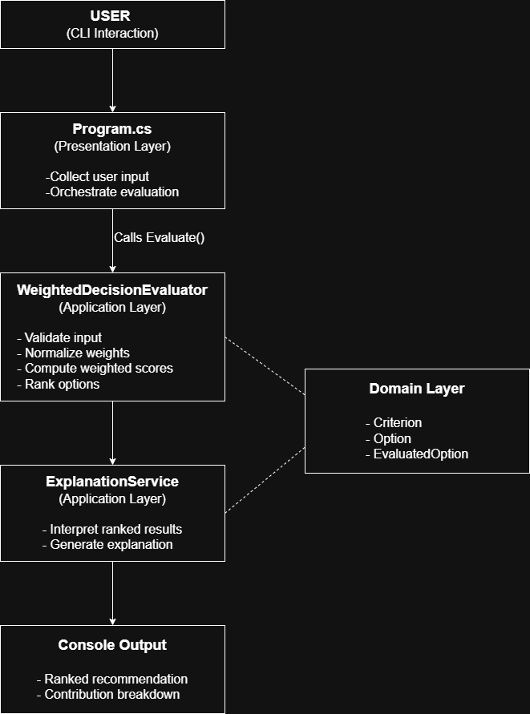

# Decision Companion System

## Overview

This project is a CLI-based Decision Companion System that helps users evaluate multiple options using weighted criteria.

The goal of this system is to build a transparent and explainable decision-making tool without relying on black-box AI logic.

The system:
- Accepts multiple criteria with weights
- Accepts multiple options
- Normalizes weights
- Computes weighted scores
- Ranks options
- Explains how the ranking was produced
- Allows users to dynamically enter inputs through CLI

---

## My Understanding of the Problem

The assignment is not just about computing scores. It is about designing a system that helps users make structured decisions.

The key expectations I identified were:

- The system must not be a static hard-coded comparison.
- Users must be able to change inputs and see different outcomes.
- The logic must be explainable.
- AI should not replace core reasoning.

From this, I understood that clarity of thinking and architecture is more important than feature count.

So I focused on building a clean and correct core evaluation engine and then exposing it through a dynamic CLI interface.

---

## Why I Structured the Solution This Way

I structured the project into three layers:

Domain Layer:
- Criterion
- Option
- EvaluatedOption

Application Layer:
- IDecisionEvaluator
- WeightedDecisionEvaluator
- ExplanationService

Presentation Layer:
- Program.cs (CLI)

I separated scoring logic from explanation logic to maintain single responsibility.

The evaluator handles only mathematical computation.
The explanation service handles interpretation.
The CLI handles input and output.

This keeps the core decision logic independent from presentation and makes the system easier to extend.

---
## Design Diagram

The architecture diagram illustrates the separation between presentation, application, and domain layers.

The CLI collects input and delegates evaluation to the WeightedDecisionEvaluator, which performs validation, normalization, scoring, and ranking. The ExplanationService then interprets results for output.

The following diagram shows the overall architecture and execution flow of the system:

---

## Design Decisions and Trade-offs

### 1. CLI Instead of Web App

I chose a CLI-based implementation because the focus of this assignment is the decision engine itself.

Adding a web interface or database would increase complexity without improving the reasoning model.

Trade-off:
- No UI layer
- Faster development
- Clearer focus on evaluation logic

---

### 2. Weighted Sum Model

The system uses a Weighted Sum Model:

FinalScore = Σ (NormalizedWeight × Score) ,where normalized weights sum to 1.

I chose this model because:
- It is deterministic
- It is easy to explain
- It supports trade-offs between criteria
- It avoids black-box behavior

Trade-off:
- The model assumes linear and compensatory trade-offs.
- It cannot enforce strict minimum constraints.

---

### 3. Weight Normalization

Weights are normalized so that their total equals 1.

This ensures:
- The final score remains within the scoring range
- Results are predictable
- Different weight scales (e.g., 1 & 1 vs 100 & 100) behave consistently

Without normalization, output magnitude would depend on arbitrary weight values.

---

### 4. No Hard Constraints (MVP Scope)

This version does not enforce strict minimum requirements.

For example, if a user requires "Performance must be at least 7", the current model cannot strictly reject options below that threshold.

This was an intentional decision to keep the MVP focused on a single decision paradigm (weighted scoring).

Future extension:
A preprocessing constraint filter can be added before scoring.

---

## Assumptions Made

- Users provide numeric scores for all criteria.
- Each option contains a score for every defined criterion.
- Criteria are independent.
- Trade-offs between criteria are allowed.
- Users understand the meaning of the weights they assign.

---

## Edge Cases Considered

- Empty criteria list → validation error
- Empty options list → validation error
- Missing score for a criterion → validation error
- Total weight equals zero → validation error
- Equal final scores → marked as tie
- Weight scale invariance is ensured through normalization

---

## How to Run the Project

1. Clone the repository.
2. Navigate to the project folder.
3. Run:

dotnet run

4. Follow the CLI prompts to enter:
   - Number of criteria
   - Criterion names and weights
   - Number of options
   - Scores for each criterion

The system will output a ranked recommendation with contribution breakdown.

---

## AI Usage

AI was used during development for:

- Clarifying mathematical concepts such as normalization and compensatory behavior.
- Brainstorming architectural structure.
- Reviewing trade-offs and edge cases.

AI was not used for decision computation.
The scoring logic is fully deterministic and explainable.

---

## What I Would Improve With More Time

- Add support for hard constraints (minimum thresholds).
- Add sensitivity analysis to observe how weight changes affect ranking.
- Add unit tests.
- Add a web interface for better usability.
- Support additional multi-criteria decision models (e.g., non-compensatory models).
- Improve input validation robustness using TryParse and retry loops.

---

## Summary

This project focuses on building a clear, explainable, and well-structured decision engine rather than maximizing features.

The emphasis is on transparency, correctness, and architectural clarity.